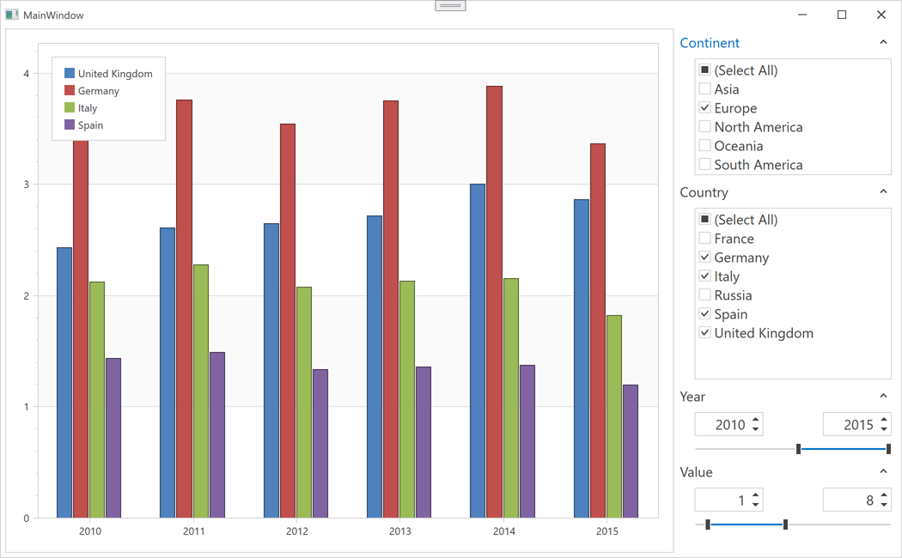

<!-- default badges list -->

<!-- default badges end -->

# Charts for WPF - Create Filter UI to Filter Series Data

The following example demonstrates how to use [FilterBehavior](https://docs.devexpress.com/WPF/DevExpress.Xpf.Core.FilteringUI.FilterBehavior?p=netframework) and [AccordionControl](https://docs.devexpress.com/WPF/118347/controls-and-libraries/navigation-controls/accordion-control?p=netframework) to create a custom Filtering UI for chart data. To apply a filter, bind a series' [Series.FilterCriteria](https://docs.devexpress.com/WPF/DevExpress.Xpf.Charts.Series.FilterCriteria?p=netframework) property to the [FilterBehavior.ActualFilterCriteria](https://docs.devexpress.com/WPF/DevExpress.Xpf.Core.FilteringUI.FilterBehavior.ActualFilterCriteria?p=netframework) property value. In this example, an accordion control contains [filter elements](https://docs.devexpress.com/WPF/DevExpress.Xpf.Core.FilteringUI.FilterElement).

## Files to Look At

* [MainWindow.xaml](./CS/ChartFiltering/MainWindow.xaml) (VB: [MainWindow.xaml](./VB/ChartFiltering/MainWindow.xaml))
* [MainWindow.xaml.cs](./CS/ChartFiltering/MainWindow.xaml.cs) (VB: [MainWindow.xaml.vb](./VB/ChartFiltering/MainWindow.xaml.vb))

## Documentation

* [Chart Control - Filter Chart Data](https://docs.devexpress.com/WPF/116571/controls-and-libraries/charts-suite/chart-control/filter-data?p=netframework)
* [Filter Behavior - Filter Elements and ChartControl](https://docs.devexpress.com/WPF/DevExpress.Xpf.Core.FilteringUI.FilterBehavior?p=netframework#filter-elements-and-chartcontrol)

## More Examples

* [How to filter series data](https://github.com/DevExpress-Examples/how-to-filter-series-data-t339646)
* [How to sort qualitative values in a custom order](https://github.com/DevExpress-Examples/how-to-sort-qualitative-values-in-a-custom-order-t318834)
